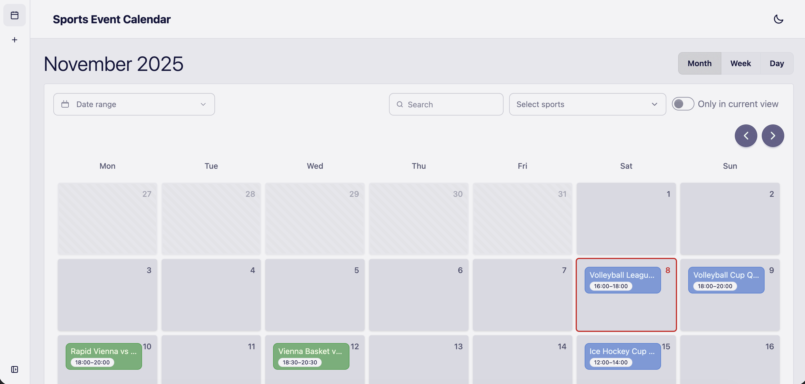
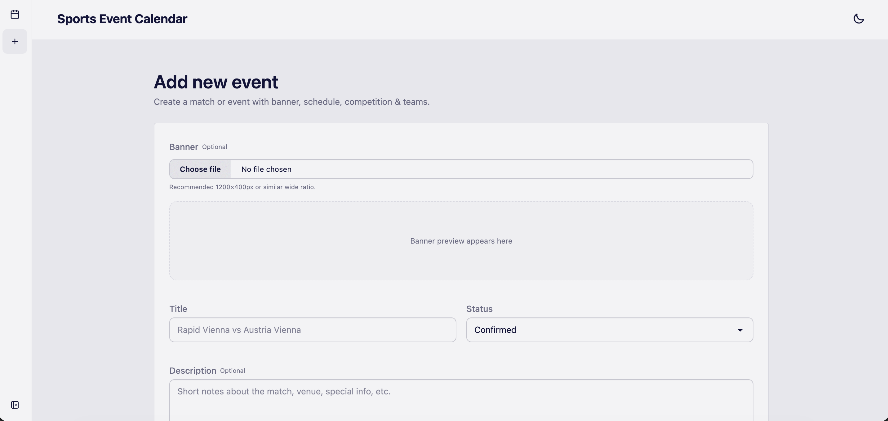
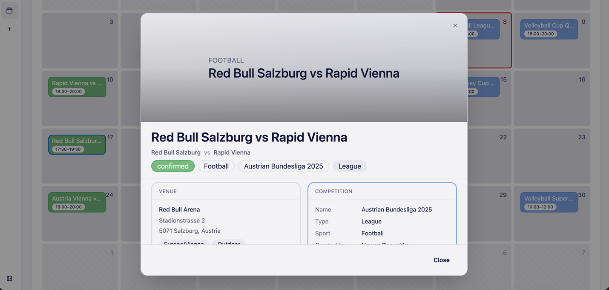

# Sports Event Calendar Webapp

A full-stack web application for managing and displaying sports events, built with a PHP API and a Vue 3 frontend.

It provides:

- A clean UI for browsing events
- CRUD for events (with banners)
- Catalog endpoints for related entities (sports, teams, venues, competitions)
- Secure, token-based API access suitable for integrations
- A containerized dev setup for quick onboarding

---

## Table of Contents

- [Highlights](#highlights)
- [Technology Stack](#technology-stack)
- [Project Structure](#project-structure)
- [Screenshots](#screenshots)
- [Prerequisites](#prerequisites)
- [Quick Start (Docker)](#quick-start-docker)
- [API Access & Tokens](#api-access--tokens)
- [Seed Data](#seed-data)
- [Frontend Development (Vite)](#frontend-development-vite)
- [Environment Variables](#environment-variables)
- [Running Without Docker](#running-without-docker-advanced)
- [REST API Overview](#rest-api-overview)
- [Database Schema](#database-schema-3nf)
- [Storage & File Uploads](#storage--file-uploads)
- [Postman Collection](#postman-collection)

---

## Highlights

- **Event Management**  
  Create, view, update, and delete events; upload/remove event banners.

- **Filtering & Search**  
  Filter by date range, sport(s), and free-text query.

- **Catalogs**  
  Read-only endpoints for sports, teams, venues, competitions.

- **User & Auth**  
  Session-based login and API token management for secure access.

- **API Key Enforcement**  
  `Authorization: Bearer <token>` or `X-Api-Key` required by default; toggleable for local dev.

- **Responsive UI**  
  Vue 3 + Vite + Tailwind CSS + DaisyUI.

- **Containerized Development**  
  Ready-to-run Docker stack (MariaDB, PHP-FPM, Nginx, frontend).

---

## Technology Stack

- **Backend:** PHP 8.3 (custom lightweight framework, PSR-4 autoload)
- **Database:** MariaDB 11 (MySQL compatible), schema & seed in `sql/`
- **Frontend:** Vue 3, Vite, Tailwind CSS, DaisyUI
- **Web Server:** Nginx (HTTPS with local self-signed certs)
- **Runtime:** `docker-compose` for DB / API / Web

---

## Project Structure

```text
api/                     # PHP API (public/index.php, routes, controllers, models, core)
frontend/                # Vue 3 + Vite frontend
docker/                  # Nginx config, self-signed TLS certs, PHP ini
sql/                     # Database schema and seed data (auto-applied)
storage/                 # Uploaded files (event banners) + logs (mounted in containers)
erd/                     # ERD diagrams (PNG)
screenshots/             # App UI screenshots
Dockerfile.api           # PHP-FPM image
Dockerfile.web           # Frontend build + Nginx runtime image
docker-compose.yml       # Orchestration for db, api, web
postman collection/      # Postman collection for API endpoints
```

---

## Screenshots

| Home / Events                         | Add Event                                  | Event Details                          |
|---------------------------------------|--------------------------------------------|----------------------------------------|
|  |  |  |

---

## Prerequisites

**Recommended**

- Docker
- Docker Compose

**Alternative (manual local dev)**

- PHP 8.3+
- Composer
- Node 20+
- MariaDB/MySQL

---

## Quick Start (Docker)

1. **Clone the repository**

   ```bash
   git clone https://github.com/NuwanDhanushka/sports-event-calendar-webapp.git
   cd sports-event-calendar-webapp
   ```

2. **Start the stack**

   ```bash
   docker compose up -d --build
   ```

   Services:

    - **db** — MariaDB (port `3306`)
    - **api** — PHP-FPM (internal), loads env from `docker-compose.yml`
    - **web** — Nginx + built frontend (`80` → redirect, `443`)

3. **Open the app**

   ```text
   https://localhost
   ```

    - HTTP is redirected to HTTPS.
    - Accept the local self-signed certificate.

---

## API Access & Tokens

All API routes are protected by an API key mechanism.

For local Docker usage:

- A **development token** is preconfigured via environment/seed so the bundled frontend can talk to the API out of the box.
- You can start the stack and use the UI without manually creating a token.

If you need to create your own token (for external tools or rotated credentials):

1. **Login with the seeded admin user**

   ```http
   POST https://localhost/api/v1/auth/login
   Content-Type: application/json

   {
     "email": "admin@gmail.com",
     "password": "admin123"
   }
   ```

2. **Create a token**

   ```http
   POST https://localhost/api/v1/api-tokens
   ```

    - Response: `{ id, token }` — store the token securely.

3. **Use the token**

    - `Authorization: Bearer <token>`  
      **or**
    - `X-Api-Key: <token>`

You can disable or enforce key checks via `REQUIRE_API_KEY` in your environment (see below).

---

## Seed Data

Automatically applied on first DB start:

- **User**
    - `admin@gmail.com` / `admin123`
- **Domain data**
    - Sports, teams, venues, competitions, sample events
- **API tokens**
    - Includes data to support local development (and supports adding your own tokens).

---

## Frontend Development (Vite)

Docker already serves the built frontend at `https://localhost`.

For local dev with hot reload:

```bash
cd frontend
npm ci
# configure frontend/.env.local (see below)
npm run dev
```

---

## Environment Variables

### API via `docker-compose`

```yaml
DB_HOST: db
DB_PORT: 3306
DB_NAME: sports_events
DB_USER: admin
DB_PASS: admin123
DB_CHARSET: utf8mb4
APP_ENV: local
REQUIRE_API_KEY: "true"
STORAGE_PUBLIC_BASE: /storage/
```

### Local `api/.env` example

```env
APP_ENV=local
DB_HOST=127.0.0.1
DB_PORT=3306
DB_NAME=sports_events
DB_USER=admin
DB_PASS=admin123
DB_CHARSET=utf8mb4
REQUIRE_API_KEY=1
STORAGE_PUBLIC_BASE=/storage/
```

### Frontend `.env.local` example

```env
# When using Docker + Nginx (same origin)
VITE_API_BASE=/api/v1

# OR when API is on 9000 and Vite on 5173
# VITE_API_BASE=http://localhost:9000/api/v1

# Optional: fixed dev token if you expose the API for external tools
# VITE_API_TOKEN=your-dev-token
```

---

## Running Without Docker (advanced)

### Backend (API)

```bash
cd api
composer install
php -S 127.0.0.1:9000 -t public
```

- API available at: `http://127.0.0.1:9000/api/v1`

### Database

- Create database `sports_events`
- Import `sql/database.sql`

### Frontend

```bash
cd frontend
npm ci
npm run dev
```

- Set `VITE_API_BASE` to your API URL (e.g. `http://127.0.0.1:9000/api/v1`).

---

## REST API Overview

**Base path:** `/api/v1`  
**Auth:** `Bearer <token>` or `X-Api-Key` (when enforced).  
Session endpoints use cookies; token management requires a logged-in user.

### Auth

- `POST /auth/login`
- `GET  /auth/me`
- `POST /auth/logout`

### API Tokens

- `POST   /api-tokens`
- `GET    /api-tokens`
- `DELETE /api-tokens/{id}`

### Events

- `GET    /event`
    - **Range mode:** `date_from`, `date_to`, `q`, `sports`
    - **Paginated mode:** `page`, `limit`
- `POST   /event`
- `GET    /event/{id}`
- `PUT    /event/{id}`
- `DELETE /event/{id}`
- `POST   /event/{id}/banner`
- `DELETE /event/{id}/banner`

### Catalogs

- `GET /sport`
- `GET /team`
- `GET /venue`
- `GET /competition`
- `GET /competition/{competitionId}/teams`

### Users

- `POST  /user` (requires valid API key, `roleId`)
- `PATCH /user/{id}` (update own profile)
- `POST  /user/{id}/password`
- `POST  /user/{id}/deactivate`

---

## Database Schema (3NF)

Key relations:

- `sports` → `teams`
- `venues` referenced by `events`
- `competitions` referenced by `events`
- `events` → `event_teams` (home/away, score, result)
- `users`, `roles`, `permissions` for admin & token management

### ERD


See `sql/database.sql` for full DDL and seed data.

---

## Storage & File Uploads

- Public files (e.g. event banners) served via: `/storage/...`
- Physical path: `./storage` (mounted into containers)
- Nginx is configured to expose this path.

---

## Postman Collection

Located at:

```text
postman collection/sport-event-calendar-endpoints.postman_collection.json
```

Suggested environment variable:

- `baseURL = https://localhost`
